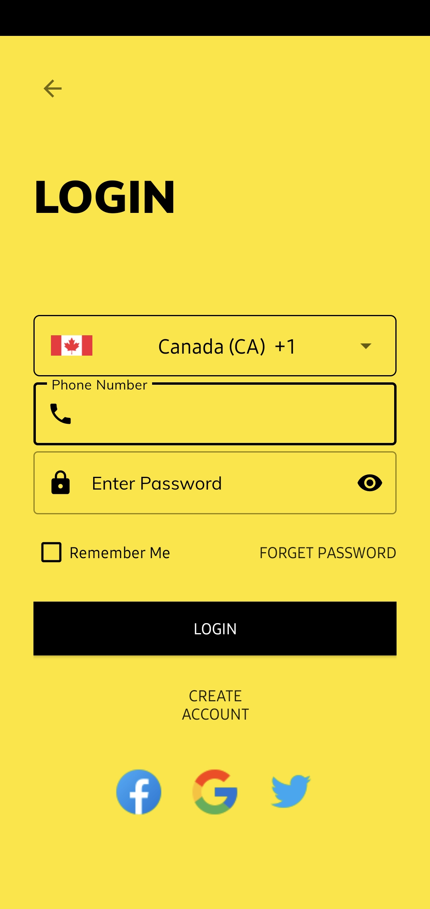

# Stay2Night - Your Ultimate Space Sharing Solution! 🌟

Hey there, it's Taimoor! 👋 Welcome to Stay2Night, where sharing spaces has never been easier.

## 🏡 About Stay2Night

Stay2Night is a revolutionary Android app designed to connect those with extra spaces to share with individuals in search of the perfect spot. From cozy rooms to convenient parking spaces, Stay2Night is your go-to platform for hassle-free space sharing.

## 📌 Key Features

✨ **List Your Spaces:** Have an extra room, parking spot, or cozy corner? List it on Stay2Night effortlessly! Showcase your space to potential users.

🌐 **Google Maps Integration:** Explore your surroundings with ease. Thanks to the power of the Google Maps API, users can view listed spaces and get a feel for the neighborhood.

🔒 **Secure Booking:** Say goodbye to the hassle of endless calls and messages. Users can directly contact space owners through the app for quick and secure bookings.

📊 **Firebase Realtime Database:** Your data is in safe hands! Stay2Night uses Firebase Realtime Database to store user registrations and space details, ensuring seamless and reliable performance.

## 🚀 Why Stay2Night?

🌈 **User-Friendly:** With a sleek and intuitive design, Stay2Night makes listing and booking spaces a breeze.

🤝 **Connect with Others:** Whether you're a traveler, student, or someone with extra space to spare, Stay2Night brings people together to create a community of space-sharing enthusiasts!

## 🚀 Getting Started

To get started with Stay2Night, follow these simple steps:

1. Clone this repository to your local machine.
2. Make sure you have the latest version of Android Studio installed.
3. Open the project in Android Studio and run the app on an emulator or a physical device.

## 📱 Screenshots

{:width="100px"}

## 🚀 Download Now!

Experience the future of space sharing! 🚀 Don't miss out—download Stay2Night today and embark on a new era of convenience and connection.

#SpaceSharing #Stay2Night #Innovation #TechRevolution

